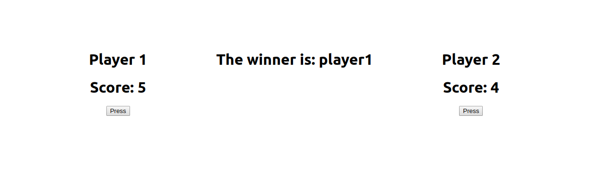

# react-liftState-cw

### Exercise 1
Create a `Player` component with player # label and a button. Call it twice from the parent component. In the parent component print out the Player number that pressed the button last.

### Exercise 2:
Make a 2 player game

Create a `Player` component. The component should have 2 labels with buttons below them. The first label should say the Player # and the second should be the player's score. The button should say “1 pt”. The `Player` component should keep up with it's score in state.

Click the appropriate button to make each player's score go up. In the parent class you should determine who's in the lead.

